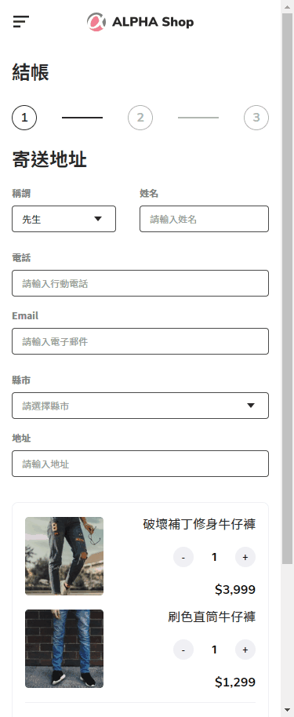

# ALPHA-Shop

AlphaCamp Project : ALPHA-Shop 切版練習

## 畫面演示

https://ypinpin.github.io/ALPHA-Shop/

## 製作紀錄

> 8/8

已完成 「stepper、form、購物籃」三個部分 (桌機版、手機版 )

以下是製作各區塊時間，包含查看設計稿取得文字顏色設定等等

- HTML 架構圖：約 1 小時
- 專案初始設定&reset css 建立： 約 1 小時
- stepper：約 4 小時
- form： 約 5 小時
- 購物籃： 約 2.5 小時
- 「上一步」和「下一步」按鈕 、桌機板微調： 約 2 小時
- javascript 相關功能： 約 1.5 小時

> 8/15

- 針對 input hover 跟 breakpoint 設定進行修正了。
- 新增完成「導覽列」和「footer」。

## 環境建置

- [Visual Studio Code](https://code.visualstudio.com/)
- [Node Version Manager (nvm) for Windows](https://github.com/coreybutler/nvm-windows/releases)
- 使用 nvm 安裝 Node.js v14.17.1
- [sass](https://www.npmjs.com/package/sass)

## 專案開發人員

> [YPINPIN](https://github.com/YPINPIN)
